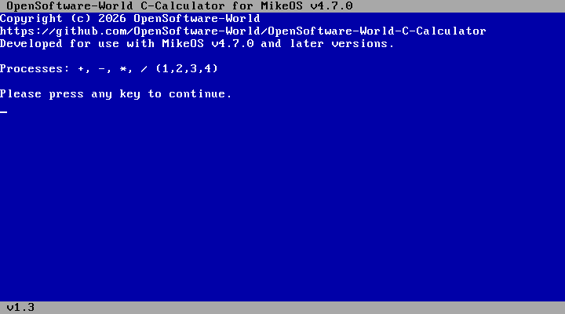

# OpenSoftware-World C-Calculator (For MikeOS and MikeOS-based OS.)

## Warnings and Notes

Warning: This project has been archived and will no longer be developed because it has fulfilled its purpose; in short, the project has achieved its goal.

* Note: This calculator software is developed only for MikeOS 4.7.0 and later versions and operating systems based on the MikeOS platform.
* Note 1: If you want to recompile this program, download the MikeOS C-Lib library using the following link: https://mikeos.sourceforge.net/libmikeos-4.2.tar.gz
* Note 2: After downloading the MikeOS C-Lib library, copy this project to the "libmikeos-4.2\sample" directory.
* Note 3: Please note that if you wish to modify or recompile the source code of this program, you must have the `bcc` compiler installed on your system. You can install it using the command `sudo apt install bcc`.

## In short, what does this application do?

This application, OpenSoftware-World C-Calculator, allows you to perform simple calculations in an optimized way on MikeOS and MikeOS-based operating systems. If you want to add a calculator to your MikeOS or MikeOS-based operating system, I recommend you take a look at this application.

## Screenshot

